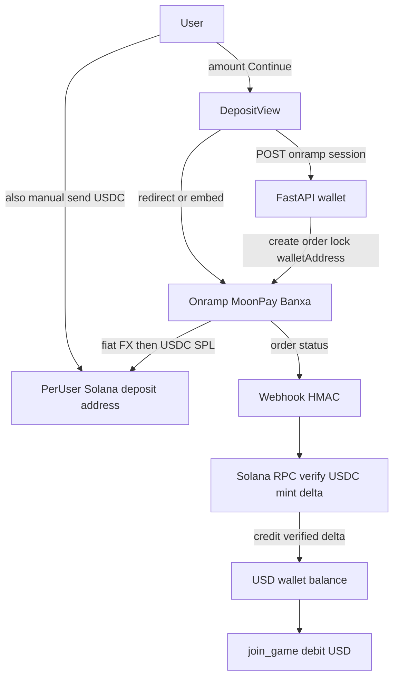

# Card → USDC on-ramp

## Product decisions (locked)

Polymarket-shaped startup: **one stablecoin**, **outsource exchanging**, stay on **Solana**. Wallet ledger details live in [solana_wallet_hardening_1b526ddb.plan.md](solana_wallet_hardening_1b526ddb.plan.md) (updated to match).

| Topic | Decision |
|---|---|
| Startup posture | Build/test **without** buying a licence first; **no public real-money** until licence + provider approval |
| Payment design | Like Polymarket early: user gets **USDC** (card via on-ramp **or** manual send); house holds **gambling USDC / USD play balance** only |
| Stablecoin | **USDC** on Solana (not EURC, not gold-backed, not USDT as EU backup under MiCA) |
| Game ledger unit | **USD** = USDC minor units (**6** decimals) |
| Chain | **Solana** (no chain switch for v1) |
| FX / price fluctuation | **At the on-ramp** (MoonPay/Banxa convert EUR/GBP/… → USDC). Ledger never holds EUR or SOL play liabilities. Residual risk = USDC≈USD depeg only |
| Card UI | Provider widget/redirect — **never** collect PAN/CVV in-app ([DepositView.tsx](Frontend/src/App/views/DepositView.tsx) mock fields must go) |
| Providers (eng) | **MoonPay** sandbox first |
| Providers (prod shortlist) | **MoonPay / Banxa** (regulator-sanctioned gaming language); iGaming rails (**Swipelux**, **GatewayCrypto**) as backup after KYB |
| Ruled out | Stripe (entry-fee+prize ban; EU lacks USDC on Solana/Base), Transak, Ramp (gambling AUP) |
| Convert product | **None** — no in-app SOL↔USDC or fiat convert |

### Corrections (do not reintroduce)

- Banxa is **not** softer than MoonPay by ToS; both need sanctioned/ licensed gambling for production.
- Card minimums/fees (~$10–20 floor, up to ~4.5% + min fee) → **batched top-ups**, not $1 per join (stake today is `Decimal("1.00")` in [Backend/Game/service.py](Backend/Game/service.py)).
- Wallet plan Phase 1b SOL convert is **cancelled**.

---

## Target architecture

Credit rule: **never trust provider amount**; credit **on-chain USDC delta** to the user's deposit address for the configured mint (`EPjFWdd5AufqSSqeM2qN1xzybapC8G4wEGGkZwyTDt1v` mainnet; `4zMMC9srt5Ri5X14GAgXhaHii3GnPAEERYPJgZJDncDU` devnet).

---

## What the house holds vs outsourcing

| House holds | Outsourced |
|---|---|
| Per-user Solana deposit keys (encrypted) + USDC ATA | Card checkout, KYC, fiat→USDC FX (MoonPay/Banxa) |
| USD play ledger (USDC units) | User buying USDC on an exchange and sending it |
| Hot wallet USDC after sweep | Off-ramp to bank (user’s problem, or later partner) |

Curaçao/CGA (when licensed): crypto only as **gambling payment**; segregated player wallets; **no** convert/exchange product for users — this design already matches that shape.

---

## Compliance gates (production cards / public money)

1. **Licence** (e.g. Curaçao B2C) before public real-money and usually before MoonPay/Banxa **live** keys.
2. **CGA-style controls** when operating under that licence: screening, withdrawal whitelist, geo-block, no player-facing convert.
3. **Custody framing**: deposit addresses = gambling rails, not a general multi-asset wallet.
4. Until then: stages D1–D3 only (below).

---

## Engineering phases

### Phase A — USD money model (with wallet Phase 1)

- USDC integer units; `GAME_STAKE_USD_UNITS`.
- Single USD play wallet; credit from USDC deposits only.
- Update [Backend/Game/service.py](Backend/Game/service.py) and [Frontend/src/Api/wallet.ts](Frontend/src/Api/wallet.ts) — show `$` / USDC, never SOL as play balance.

### Phase B — Deposit address + USDC verification (wallet Phases 2–4)

- Per-user address + USDC ATA; mint-checked credit; reject non-USDC for play.
- Manual deposit UX: real address from API; copy **USDC on Solana only**.

### Phase C — Card on-ramp session API

Backend ([Backend/Wallet/router.py](Backend/Wallet/router.py) or `Backend/Wallet/onramp.py`):

| Endpoint | Job |
|---|---|
| `POST /wallet/onramp/session` | Auth; ensure deposit address; create provider order with locked walletAddress + amount; return checkout URL / widget config |
| `POST /wallet/webhook/onramp` | Idempotent order status; **balance still only from on-chain USDC credit** |
| `GET /wallet/onramp/quote` | Fee/min before redirect |

Config: `MOONPAY_PUBLISHABLE_KEY`, `MOONPAY_SECRET_KEY`, webhook secret; test vs live split.

Frontend [DepositView.tsx](Frontend/src/App/views/DepositView.tsx):

- Remove card number / CVV / expiry inputs.
- Card tab: amount (min ~$25), fee disclosure, **Continue to checkout**.
- Solana tab: deposit address + USDC-only warning + balance poll.

Thin **provider adapter** so Banxa/Swipelux can replace MoonPay session creation later.

### Phase D — Licence-free test stages

| Stage | Purpose | Licence? |
|---|---|---|
| **D1 Devnet** | Circle faucet → deposit → credit/sweep/withdraw | No |
| **D2 MoonPay sandbox** | Test cards; checkout + webhook. Sandbox Solana = **native SOL only**, not USDC SPL — separate from D1 USDC credit | No |
| **D3 Mainnet self-fund** | Team sends real USDC to prod deposit addresses | No public users |
| **Prod cards** | Live MoonPay/Banxa/… | Licence + KYB |

### Phase E — Production provider onboarding

1. Apply MoonPay + Banxa with product disclosure, Solana USDC, per-user addresses, small order sizes.
2. Optional iGaming backup (Swipelux / GatewayCrypto).
3. No Transak/Ramp/Stripe for this product.
4. Minimum deposit + fee disclosure in UI.

### Phase F — Pre-public launch controls

- Wallet screening, withdrawal whitelist, geo-block as required by chosen licence.
- Audit: tx_hash, order_id, credited amount, screening result.
- Keep **no** in-app convert.

---

## File touchpoints

- [Backend/Wallet/router.py](Backend/Wallet/router.py), [Backend/Wallet/services.py](Backend/Wallet/services.py)
- [Backend/config.py](Backend/config.py) — keys, USDC mint, stake units
- [Frontend/src/App/views/DepositView.tsx](Frontend/src/App/views/DepositView.tsx)
- [Frontend/src/Api/wallet.ts](Frontend/src/Api/wallet.ts)
- [solana_wallet_hardening_1b526ddb.plan.md](solana_wallet_hardening_1b526ddb.plan.md) — USD/USDC; Phase 1b cancelled (**done**)

---

## Out of scope

- Wallet hardening Phases 0–7 implementation (separate plan).
- Final production partner (KYB outcome); eng targets **MoonPay sandbox** + adapter.
- Fiat bank balances / Kalshi-style ACH (possible much later; not v1).
