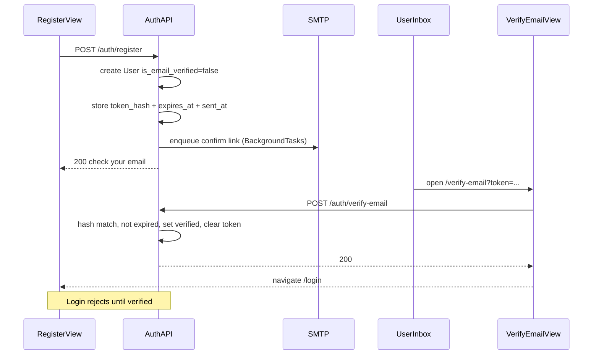

# Email confirmation on registration

## Decisions (locked)

- **Transport:** SMTP via env vars (`aiosmtplib` async send).
- **Gate:** unconfirmed accounts **cannot log in** (403 with a clear message).
- **Token storage:** hashed one-time token + expiry on `User` (not a signed JWT-only link), so resend can invalidate the previous token.
- **Expiry:** keep `email_verification_expires_at` (default **24h**). Links that never expire are uncommon in production — a leaked or old inbox link would work forever. Resend rotates the hash *and* resets expiry.
- **Existing users:** migration backfills `is_email_verified=True` so current accounts are not locked out.
- **Login error type:** dedicated `EmailNotVerifiedError` that is **not** a `ValueError` subclass (current login handler maps all `ValueError` → 401).
- **Migration scope:** one hand-written migration for **all** pending `User` columns (email verification + any age-review fields already in the model). Do not use `--autogenerate` for this step. `down_revision` = whatever `alembic heads` reports at implement time.

## Why both token columns

| Column | Needed? | Why |
|--------|---------|-----|
| `email_verification_token_hash` | **Yes** | Store only a hash of the raw link token. Resend rotates it so the previous link dies. Plain JWT-only links cannot be invalidated without a denylist. |
| `email_verification_expires_at` | **Yes (keep)** | Standard for email verification (Auth0, Firebase, Django, etc. use hours–days). Without it, old/stolen links stay valid until someone resends. |
| `email_verification_sent_at` | **Yes (add)** | Cheap in-DB throttle for resend (60s) so SMTP cannot be used as an email bomb; no Redis required. |

## End-to-end flow

## Backend

### 1. User model + Alembic migration

Extend [`Backend/Auth/models.py`](Backend/Auth/models.py) with email fields (alongside any other pending User columns in the same migration):

- `is_email_verified = Column(Boolean, nullable=False, default=False, server_default=text("false"))`
- `email_verification_token_hash = Column(String, nullable=True, index=True)` — indexed; lookup key on verify
- `email_verification_expires_at = Column(DateTime(timezone=True), nullable=True)`
- `email_verification_sent_at = Column(DateTime(timezone=True), nullable=True)`

New migration under [`Backend/migrations/versions/`](Backend/migrations/versions/) — **hand-written** `op.add_column` only (no autogenerate):

1. Add columns with `server_default` where needed so existing rows are valid.
2. `UPDATE users SET is_email_verified = true` for all current rows.
3. Keep app default `False` for new registrations.

### 2. Config + dependency

Add to [`Backend/config.py`](Backend/config.py):

- `SMTP_HOST: str = ""` (empty = skip send, log verify URL for local/dev)
- `SMTP_PORT` (default `587`), `SMTP_USER`, `SMTP_PASSWORD`, `SMTP_FROM`
- `SMTP_STARTTLS: bool = True`
- `SMTP_TIMEOUT_SECONDS: int = 10`
- `FRONTEND_URL: str = "http://localhost:5173"` (confirm links; keep separate from `CORS_ORIGINS` but set both in deploy)
- `EMAIL_VERIFY_EXPIRE_HOURS: int = 24`
- `EMAIL_RESEND_COOLDOWN_SECONDS: int = 60`

Add `aiosmtplib` to [`Backend/requirements.txt`](Backend/requirements.txt).

### 3. Email helper

New module [`Backend/Core/email_sender.py`](Backend/Core/email_sender.py) (avoid naming a package file `email.py` next to stdlib `email`):

- `generate_verification_token() -> str` — `secrets.token_urlsafe(32)`
- `hash_token(token: str) -> str` — SHA-256 hex (not bcrypt)
- `async def send_verification_email(to: str, token: str)` — build `{FRONTEND_URL}/verify-email?token=...`, send plain-text (+ simple HTML optional) via `aiosmtplib` with explicit `timeout=settings.SMTP_TIMEOUT_SECONDS`
- If `SMTP_HOST` is empty: **do not send**; log the full verify URL (local/dev path without Mailtrap)

Tests mock/patch `send_verification_email` at the **import site** used by the service (e.g. `Backend.Auth.service.send_verification_email` if rebound there).

### 4. Auth service / routes

Update [`Backend/Auth/service.py`](Backend/Auth/service.py):

**Register** ([`register_user`](Backend/Auth/service.py) ~lines 22–62):

- Create user with `is_email_verified=False`.
- Generate raw token; store `hash_token(raw)`, `expires_at`, `sent_at`.
- Commit, then enqueue send via FastAPI `BackgroundTasks` (response must not wait on SMTP). Send failure: log only; still return 200; user can resend — do not roll back the account.
- Response stays a success payload; do **not** auto-login.

**Login** ([`login_user`](Backend/Auth/service.py) ~lines 65–83):

- After password check succeeds, if `not user.is_email_verified`, raise `EmailNotVerifiedError` (dedicated class, **not** subclassing `ValueError`).
- In [`Backend/Auth/router.py`](Backend/Auth/router.py) login handler: catch `EmailNotVerifiedError` **before** `ValueError` and map to **403** with a clear detail; leave invalid credentials as 401.

**Expiry / SQLite:** when comparing `expires_at` to now, normalize with an `_as_utc`-style helper (same pattern as [`Backend/Game/service.py`](Backend/Game/service.py) `_as_utc`). Auth tests use SQLite, which returns naive datetimes — naive vs aware compares raise `TypeError`.

**New endpoints** in [`Backend/Auth/router.py`](Backend/Auth/router.py):

| Method | Path | Behavior |
|--------|------|----------|
| `POST` | `/auth/verify-email` | Body `{ "token": "..." }`. Look up by hash, check expiry (via `_as_utc`), set `is_email_verified=True`, clear token/expiry/sent fields. Invalid/expired → 400. |
| `POST` | `/auth/resend-verification` | Body `{ "email": "..." }`. If user exists and unverified: if `sent_at` within cooldown, skip send but still return generic 200; else rotate token + expiry + sent_at and enqueue email. Always same generic 200 (no enumeration). |

Schemas in [`Backend/Auth/schemas.py`](Backend/Auth/schemas.py): `VerifyEmailRequest`, `ResendVerificationRequest`.

Optional: expose `is_email_verified` on `UserResponse` for `/auth/me` (useful later; not required for the block-at-login gate).

**Known limitation (do not “fix” in this plan):** `POST /auth/register` still returns `"Email already registered"`, so resend’s generic 200 does not fully close enumeration. Record only; register anti-enumeration is a follow-up.

### 5. Tests

Update [`Backend/Tests/Auth/`](Backend/Tests/Auth/) and shared fixtures:

- Autouse mock of `send_verification_email` in a shared [`Backend/Tests/conftest.py`](Backend/Tests/conftest.py) (or Auth + Wallet confests) so no suite hits real SMTP.
- Patch target = the name bound in the auth service module.
- Register → `is_email_verified` false; login before verify → 403.
- Verify with valid token → 200; then login → 200 + cookie.
- Expired / wrong token → 400 (expired case: write a past naive `expires_at` in DB so SQLite path is covered).
- Resend rotates token (old fails, new works); resend within cooldown still returns 200 without rotating (assert via mock call count or DB hash unchanged).
- Fix existing Auth register/login tests: include `username`; verify user (or set `is_email_verified=True` in DB) before login assertions that expect 200.
- Fix [`Backend/Tests/Wallet/conftest.py`](Backend/Tests/Wallet/conftest.py) `auth_user`: add `username`, verify (or mark verified) before login; do not read `access_token` from JSON (cookie-only login).

## Frontend

### 6. Post-register UX

[`Frontend/src/App/views/RegisterView.tsx`](Frontend/src/App/views/RegisterView.tsx): on success, navigate to `/login` with state or query (`?registered=1`) and show “Check your email to confirm your account before signing in.”

### 7. Verify page

- New route `/verify-email` in [`Frontend/src/main.tsx`](Frontend/src/main.tsx).
- New view that reads `token` from the query string, calls `POST /auth/verify-email` **once** (avoid double-fire if `StrictMode` is added later — e.g. ref guard or submit-on-mount with cleanup), then redirects to login with success message (or shows invalid/expired error).

Thin API wrappers in [`Frontend/src/Api/auth.ts`](Frontend/src/Api/auth.ts): `verifyEmail`, `resendVerification`.

### 8. Login gate messaging (required context change)

[`Frontend/src/App/views/LoginView.tsx`](Frontend/src/App/views/LoginView.tsx) + [`AuthContext.login`](Frontend/src/Context/AuthContext.tsx) / `register`:

- Change `login` (and ideally `register`) from `Promise<boolean>` to a result object that surfaces `detail` + status (e.g. `{ ok: false; error: string; status?: number }`). Silent `false` cannot drive the 403 UI.
- On 403 email-not-verified: show message + **Resend confirmation** (email already on the form).
- On other failures: show API `detail`.
- Register failures: show API errors on the register form.

(Align with the MiVOLO plan’s register result-object change in one pass if both land close together.)

## Local setup (after implement)

1. Optional: set SMTP vars in `Backend/.env` (Mailtrap / Gmail app password). If `SMTP_HOST` is empty, copy the verify URL from backend logs.
2. Set `FRONTEND_URL=http://localhost:5173`.
3. `alembic upgrade head`.
4. Register → open link → confirm → login.

## Out of scope

- Password-reset emails (same SMTP helper can be reused later).
- Changing email after account creation.
- Redis-backed rate limits beyond the 60s `sent_at` cooldown.
- Closing register-time email enumeration.
- Blocking register until MiVOLO age check (separate plan; share one User migration if both land together).
