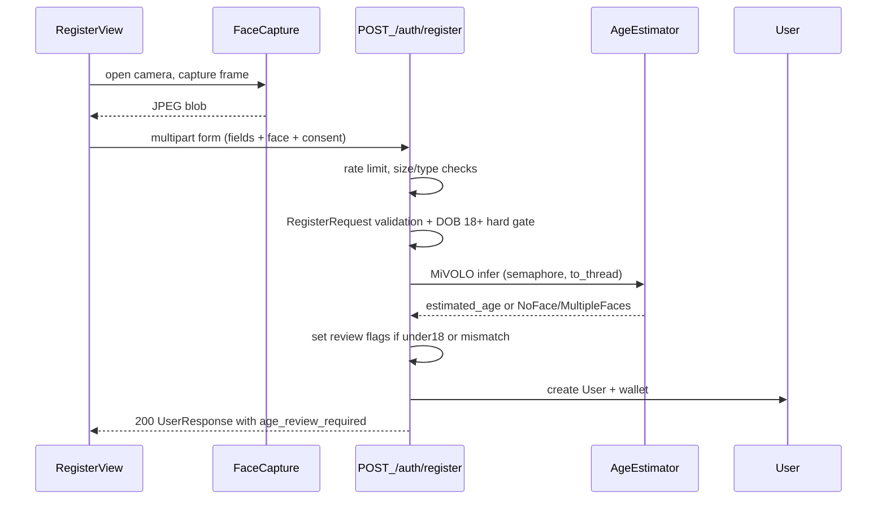

# MiVOLO age estimation in registration

## Decisions (locked)

- **Capture:** live webcam / phone camera on the register page (no file upload).
- **Under 18 estimate:** registration **succeeds**, account flagged for review / possible KYC.
- **DOB vs estimate mismatch:** same — succeed + flag (threshold: **|reported_age − estimated_age| >= 5** years, reflecting MiVOLO's ~4 MAE).
- **Hard gates unchanged:** self-reported DOB must still be 18+ (existing logic in [`Backend/Auth/service.py`](Backend/Auth/service.py)).
- **Biometrics:** do **not** persist face images; store only estimate + review metadata.
- **No face detected:** reject registration with a clear error (need one usable face for the check).
- **Multiple faces detected:** reject with "make sure you are alone in frame" — do not guess which face is the registrant.
- **Estimator unavailable** (weights missing / load failure): registration returns **503**, fail closed. Tests use a stub, so this never affects CI.
- **Flag consequence:** flagged accounts can register, log in, deposit and play, but **cannot withdraw** until cleared.
- **Consent:** required checkbox, not just a notice; store `age_check_consent_at`.

## End-to-end flow



## Backend

### 1. User model + migration

Extend [`Backend/Auth/models.py`](Backend/Auth/models.py) (currently ends at `fcm_token`, line 20):

- `estimated_age = Column(Float, nullable=True)`
- `age_review_required = Column(Boolean, nullable=False, default=False, server_default=text("false"))`
- `age_review_reasons = Column(JSON, nullable=False, default=list, server_default=text("'[]'"))` — list of `"underage_estimate"` / `"dob_mismatch"`
- `kyc_status = Column(String(16), nullable=False, default="none", server_default="none")` — `none` | `required` | `pending` | `cleared`
- `age_check_consent_at = Column(DateTime(timezone=True), nullable=True)`

When flagged: `age_review_required=True`, `kyc_status="required"`.

**Gap fixed:** every non-nullable column needs `server_default`, otherwise `alembic upgrade head` fails on the existing populated `users` table. Use generic `sqlalchemy.JSON` (not `JSONB`) so the SQLite test DB in [`Backend/Tests/Auth/conftest.py`](Backend/Tests/Auth/conftest.py) still builds the schema via `Base.metadata.create_all`.

New migration in [`Backend/migrations/versions/`](Backend/migrations/versions/), down-revision = `5fb2556c34e7`.

### 2. Age estimation module

New package `Backend/AgeEstimation/`:

- `service.py` — `AgeEstimator` wrapping MiVOLO `Predictor.recognize(image)`
- `errors.py` — `NoFaceError`, `MultipleFacesError`, `EstimatorUnavailableError`
- `dependencies.py` — `get_age_estimator()` FastAPI dependency

Behavior:

- **Lazy singleton load** behind an `asyncio.Lock` on first request, not in [`Backend/lifespan.py`](Backend/lifespan.py). Warm-loading torch weights at startup can exceed `healthcheckTimeout = 30` in [`Backend/railway.toml`](Backend/railway.toml) and put the service in a restart loop.
- Inference in `asyncio.to_thread(...)` guarded by a `asyncio.Semaphore(2)` so concurrent registrations cannot starve the event loop; also set `torch.set_num_threads(2)`.
- Treat a `None` age from MiVOLO (`fill_in_results` can leave age unset when a crop fails) as `NoFaceError` — do not store `None` as a passing check.
- Return a single `float` age from the one detected face.

**Exposed as a dependency** (`get_age_estimator`) specifically so tests can do `app.dependency_overrides[get_age_estimator] = ...`, mirroring how `get_session` is overridden today:

```22:27:Backend/Tests/Auth/conftest.py
    # Override get_session to use the test database instead of the real one
    async def override_get_session():
        async with TestSession() as session:
            yield session

    app.dependency_overrides[get_session] = override_get_session
```

Config additions in [`Backend/config.py`](Backend/config.py):

- `MIVOLO_CHECKPOINT: str = ""`, `MIVOLO_DETECTOR_WEIGHTS: str = ""`, `MIVOLO_DEVICE: str = "cpu"`
- `AGE_MISMATCH_YEARS: int = 5`
- `AGE_MIN_ESTIMATE: int = 18`
- `FACE_MAX_BYTES: int = 5_000_000`
- `FACE_MAX_PIXELS: int = 25_000_000`
- `REGISTER_RATE_LIMIT_PER_HOUR: int = 10`

Weights live in `Backend/AgeEstimation/weights/` (not committed).

### 3. Dependencies

Two files, both required in production:

- [`Backend/requirements.txt`](Backend/requirements.txt) gains **`python-multipart`**. This is not optional — FastAPI raises at route-definition time if a route uses `File`/`Form` without it, so a "lean core" install would fail to boot the whole app, not just the age check.
- New `Backend/requirements-age.txt`: `torch` (CPU wheels), `timm`, `ultralytics`, `opencv-python-headless`, plus MiVOLO itself (pin a commit; it is not on PyPI).

**Gap fixed —** [`.gitignore`](.gitignore) ignores `*.txt` with only one negation, so `requirements-age.txt` would be silently untracked:

```69:70:.gitignore
*.txt
!Backend/requirements.txt
```

Add `!Backend/requirements-age.txt`. Same problem for test fixtures: `*.jpg` / `*.png` / `*.jpeg` are ignored at lines 58-60, so add `!Backend/Tests/**/fixtures/*.jpg` (or synthesize test images as numpy arrays and avoid fixtures entirely).

### 4. Registration API change

Change `POST /auth/register` in [`Backend/Auth/router.py`](Backend/Auth/router.py) to **multipart**, but keep the Pydantic model as the validation layer:

```21:26:Backend/Auth/router.py
@router.post("/register")
async def register(request: RegisterRequest, session=Depends(get_session)):
    try:
        return await AuthService.register_user(request, session)
    except ValueError as e:
        raise HTTPException(status_code=400, detail=str(e))
```

becomes a route taking `Form(...)` fields + `face: UploadFile = File(...)` + `consent: bool = Form(...)`, which then does `RegisterRequest.model_validate({...})` and converts `pydantic.ValidationError` into a **422**.

**Gap fixed:** naively replacing the body with `Form(...)` params silently drops the password rules and email validation in [`Backend/Auth/schemas.py`](Backend/Auth/schemas.py) lines 11-22, and breaks the existing 422 expectation in `test_register_user_incorrect_password`.

Order of operations in the route/service:

1. Per-IP rate limit (Redis) → 429 when exceeded
2. `face.content_type` in `{image/jpeg, image/png}`; read at most `FACE_MAX_BYTES` and reject larger; decode and reject if `w*h > FACE_MAX_PIXELS`
3. `consent` must be true → else 400
4. `RegisterRequest` validation (422) and existing DOB 18+ / future-DOB / duplicate-email checks (400)
5. MiVOLO estimate → `NoFaceError` / `MultipleFacesError` → 400; `EstimatorUnavailableError` → 503
6. Build reasons: `underage_estimate` if `estimated_age < AGE_MIN_ESTIMATE`; `dob_mismatch` if `abs(estimated_age - dob_age) >= AGE_MISMATCH_YEARS`
7. Create user with estimate, flags, `age_check_consent_at`, then wallet as today
8. Return `UserResponse`

Rate limiting reuses the existing Redis client factory:

```5:12:Backend/Core/redis_config.py
async def create_redis_client() -> Redis:
    """
    Creates and configures a Redis client.
    Enables keyspace expiration events (Kx) required by showdown_scheduler.
    """
```

Remove the TODO at line 20 of [`Backend/Auth/service.py`](Backend/Auth/service.py).

### 5. Response schema

Add `age_review_required: bool` to `UserResponse` in [`Backend/Auth/schemas.py`](Backend/Auth/schemas.py) lines 28-32. Note this schema is also returned by `GET /auth/me` ([`Backend/Auth/router.py`](Backend/Auth/router.py) lines 52-58), which is intended: the logged-in UI can then show a persistent "verification pending" banner.

### 6. KYC gate on money out

Flags must do something or the feature is inert. Add a check in [`Backend/Wallet/router.py`](Backend/Wallet/router.py) so debits are refused while review is outstanding:

```23:27:Backend/Wallet/router.py
@router.post("/debit", response_model=TransactionResponse)
async def debit_wallet(data: AmountRequest, current_user: User = Depends(get_current_user), session: AsyncSession = Depends(get_session)):
    wallet_service = WalletService(session)
    transaction = await wallet_service.debit(current_user.id, data.amount)
    return transaction
```

Return 403 with "identity verification required" when `current_user.kyc_status == "required"`. Deposits, joining games and login stay open.

### 7. Tests

[`Backend/Tests/Auth/test_register.py`](Backend/Tests/Auth/test_register.py) needs rewriting to multipart, with a stub estimator injected via `app.dependency_overrides[get_age_estimator]`.

Note the first test is **already failing** before this feature: it omits `username`, which the schema requires, so it gets 422 rather than the asserted 200.

```4:13:Backend/Tests/Auth/test_register.py
async def test_register_user(client):
    response = await client.post("/auth/register", json={
        "email": "test@example.com",
        "password": "Secret123",
        "country": "CZ",
        "dob": "2000-01-01"
    })
    assert response.status_code == 200
```

Cases to cover: clear pass (no flags); `underage_estimate` flag; `dob_mismatch` flag; both flags; no face → 400; multiple faces → 400; estimator unavailable → 503; missing consent → 400; weak password → 422; DOB under 18 → 400; oversized upload → 400; debit blocked while `kyc_status == "required"`.

## Frontend

### 8. Webcam capture

New `Frontend/src/App/components/FaceCapture.tsx`, used by [`Frontend/src/App/views/RegisterView.tsx`](Frontend/src/App/views/RegisterView.tsx):

- `getUserMedia({ video: { facingMode: "user" } })`, preview + Capture button → canvas → JPEG `Blob` (downscale to ~1280px long edge before upload)
- `<video autoPlay muted playsInline />` — without `playsInline` iOS Safari refuses to render inline
- Stop tracks on unmount (`stream.getTracks().forEach(t => t.stop())`) so the camera indicator turns off
- Handle `NotAllowedError` / `NotFoundError` with readable copy
- Secure-context caveat: `getUserMedia` only works on `localhost` or HTTPS, so testing from a phone against a LAN IP will fail

Also add to the form: required consent checkbox, and block submit until a frame is captured. The submit button today only checks `isLoading`:

```235:241:Frontend/src/App/views/RegisterView.tsx
          <button
            type="submit"
            disabled={auth?.isLoading}
            className="mt-1 w-full py-2.5 rounded-lg bg-gray-900 text-white text-sm font-medium hover:bg-gray-700 active:bg-gray-800 transition disabled:opacity-60 disabled:cursor-not-allowed"
          >
            {auth?.isLoading ? "Registering…" : "Register"}
          </button>
```

`RegisterView` has no error state at all right now, so add one and render backend messages above the submit button.

### 9. API client + context contract

[`Frontend/src/Api/auth.ts`](Frontend/src/Api/auth.ts): `register` builds `FormData` (fields + `face` blob + `consent`) instead of JSON.

**Gap fixed —** the context currently collapses every failure into `false`, so there is no way to show "no face detected" or "service unavailable":

```62:73:Frontend/src/Context/AuthContext.tsx
  const register = async (data: RegisterData): Promise<boolean> => {
    setIsLoading(true);
    try {
      const res = await apiRegister(data);
      return res != null;
    } catch (err) {
      console.error("Register failed:", err);
      return false;
    } finally {
      setIsLoading(false);
    }
  };
```

Change the signature to return `{ ok: true; ageReviewRequired: boolean } | { ok: false; error: string }`, mapping the axios error to `err.response?.data?.detail`. On success with `ageReviewRequired`, show a soft notice on the login screen ("your account needs identity verification before withdrawals").

## Deployment

### 10. Docker image and weights

The current image copies only the repo and installs `requirements.txt`:

```7:10:Backend/Dockerfile
COPY requirements.txt /tmp/requirements.txt
RUN pip install --no-cache-dir -r /tmp/requirements.txt

COPY . /app/Backend/
```

**Gap fixed:** weights are not in the repo, so as written the deployed container would have no model and every registration would 503 forever. Add a build step that downloads the detector + MiVOLO checkpoint into the image (via `huggingface_hub` from the published MiVOLO / mirror repos — the upstream Google Drive links are not scriptable in a build), and install `requirements-age.txt` with CPU-only wheels:

```
pip install --no-cache-dir -r /tmp/requirements-age.txt --extra-index-url https://download.pytorch.org/whl/cpu
```

Also:

- Raise `healthcheckTimeout` in [`Backend/railway.toml`](Backend/railway.toml) from 30 to 120 to absorb a cold first inference.
- Memory: torch + `yolov8x_person_face.pt` + `mivolo_d1` on CPU needs well over 1 GB resident. Run the age model in face-only mode (no person branch) to cut footprint, and expect to size the Railway service up. If it does not fit, the fallback is a separate inference service — treat that as a follow-up, not part of this change.

## Risks accepted

- **Accuracy:** MiVOLO's MAE is ~4 years, so a 5-year mismatch threshold will still produce false flags. That is tolerable because the outcome is a review flag, never a rejection.
- **Liveness:** holding up a photo or another person's face to the camera defeats this check. Mitigated only by capturing from a live `MediaStream` (no file picker) and rate limiting; genuine liveness detection is out of scope.
- **Licensing:** MiVOLO's top-level LICENSE is Apache-2.0 while its `setup.py` classifier declares CC BY-SA 4.0, and the checkpoints derive from datasets with their own terms. Verify this before any commercial launch of a real-money app.
- **Data protection:** face images are processed and discarded, but the derived estimate is still personal data. The consent checkbox, a privacy-policy update, and a retention statement are required; a DPIA is likely expected for a gambling-adjacent service in the EU.

## Out of scope (follow-ups)

- Admin UI to clear flags / review queue, and ID-document upload for the actual KYC step
- Persisting face images or integrating a third-party KYC vendor
- Auto-login after register (current navigate-to-login behavior stays)
- Separate GPU inference service

## Setup notes for local dev

1. `pip install -r Backend/requirements.txt -r Backend/requirements-age.txt`
2. Download detector + MiVOLO checkpoint into `Backend/AgeEstimation/weights/`
3. Set `MIVOLO_CHECKPOINT`, `MIVOLO_DETECTOR_WEIGHTS`, `MIVOLO_DEVICE=cpu` in `Backend/.env`
4. `alembic upgrade head`
5. Register via `http://localhost:5173` (camera requires localhost or HTTPS)
