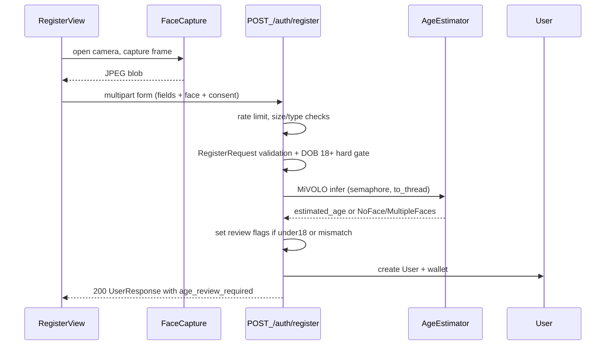

# MiVOLO age estimation in registration

## Decisions (locked)

- **Capture:** live webcam on the register page (no file upload).
- **Under 18 estimate / DOB mismatch:** registration succeeds; account flagged (`|reported − estimated| >= 5` years).
- **Hard gate unchanged:** self-reported DOB must still be 18+ (`Backend/Auth/service.py`).
- **Biometrics:** do not persist face images; store estimate + review metadata only.
- **No face / multiple faces:** reject registration (clear error). Never guess which face.
- **Estimator unavailable:** fail closed with **503**. Tests stub the dependency.
- **Flag consequence:** can register/login/deposit/play; **cannot withdraw** until cleared.
- **Consent:** required checkbox; store `age_check_consent_at`.

## End-to-end flow



## 1. User model + migration — done

Columns in `Backend/Auth/models.py` + migration `b8e3f1a92c04_...`. When flagged: `age_review_required=True`, `kyc_status="required"`.

## 2. Age estimation module (build this next)

Package `Backend/Age_estimation/` (underscore; do not rename):

| File | Role |
|---|---|
| `service.py` | `AgeEstimator` wrapping MiVOLO |
| `errors.py` | `NoFaceError`, `MultipleFacesError`, `InvalidImageError`, `ImageTooLargeError`, `EstimatorUnavailableError` |
| `dependencies.py` | `get_age_estimator()` FastAPI dependency |
| `weights/.gitkeep` | checkpoints (never committed) |

No `__init__.py`, no router.

**Errors must not subclass `ValueError`** — `Auth/router.py` maps all `ValueError` → 400; `EstimatorUnavailableError` must stay 503.

### Public API: bytes in

```python
class AgeEstimator:
    async def estimate_age_from_bytes(self, data: bytes) -> float:
        ...
```

This package is the **only** place that may import `cv2` / numpy / torch / mivolo. It owns:

1. decode bytes → BGR; fail → `InvalidImageError` (400)
2. `w * h > FACE_MAX_PIXELS` → `ImageTooLargeError` (400)
3. inference → `float`, or `NoFaceError` / `MultipleFacesError` (400), `EstimatorUnavailableError` (503)

Route-only checks (no image libs): `content_type` allow-list + `FACE_MAX_BYTES` read cap.

### Load

- Lazy singleton behind `asyncio.Lock` on first request — **not** in `lifespan.py` (startup load can trip Railway `healthcheckTimeout`).
- Validate weight paths **before** the lock; negative-cache load failures ~60s (avoids request pile-up).
- Lazy-import `torch`, `cv2`, `mivolo.predictor.Predictor` inside load/infer. Module scope: `asyncio`, `types`, `pathlib`, settings, local errors only.
- `torch.set_num_threads(2)` once at load.
- Build config as `types.SimpleNamespace`: `detector_weights`, `checkpoint`, `device`, `with_persons=False`, `disable_faces=False`, `draw=False`.
- Upstream `Predictor` hardcodes `half=True`. If FP16 fails on CPU, construct `Detector` + `MiVOLO(..., half=False)` directly.
- Cache only a successful predictor.

### Inference

- Run in `asyncio.to_thread(...)` under `asyncio.Semaphore(2)` (use `1` on 1-vCPU Railway).
- `recognize(image)` → `(PersonAndFaceResult, drawn)`; ignore drawn (`None` when `draw=False`).
- `n_faces == 0` → `NoFaceError`; `n_faces > 1` → `MultipleFacesError`. Do **not** use `n_objects` / `n_persons` (person box is emitted for the same human).
- Age from face row only: `face_inds = detected.get_bboxes_inds("face")` then `detected.ages[face_inds[0]]`.
- `None` age → `NoFaceError`.
- Return one `float`. No gender. Never persist the image.
- Touch only `n_faces`, `get_bboxes_inds()`, `ages` (duck-typed fakes work in unit tests).

### Dependency + stub

`get_age_estimator` must be **sync** and not load weights — so tests can override it like `get_session`:

```python
class StubEstimator:
    def __init__(self, age: float = 25.0):
        self.age = age

    async def estimate_age_from_bytes(self, data: bytes) -> float:
        return self.age
```

### Config (`Backend/config.py`) — all need defaults

| Key | Default |
|---|---|
| `MIVOLO_CHECKPOINT` | `""` |
| `MIVOLO_DETECTOR_WEIGHTS` | `""` |
| `MIVOLO_DEVICE` | `"cpu"` |
| `AGE_MISMATCH_YEARS` | `5` |
| `AGE_MIN_ESTIMATE` | `18` |
| `FACE_MAX_BYTES` | `5_000_000` |
| `FACE_MAX_PIXELS` | `25_000_000` |
| `REGISTER_RATE_LIMIT_PER_HOUR` | `10` |

### Gitignore

```gitignore
*.pt
*.pth
*.ckpt
Backend/Age_estimation/weights/*
!Backend/Age_estimation/weights/.gitkeep
!Backend/requirements-age.txt
```

(`.gitignore` already ignores `*.txt` / image fixtures — negate what you need.)

### Unit tests (`Backend/Tests/Age_estimation/test_estimator.py`)

Patch the loader; no torch required. Cover: empty/missing weights → `EstimatorUnavailableError`; `n_faces` 0 / >1 / age `None` → `NoFaceError` / `MultipleFacesError`; age `22.4` → `22.4`; garbage bytes → `InvalidImageError`.

Run pytest from `Backend/` (`asyncio_mode = auto` in `pytest.ini`).

## 3. Dependencies

- `Backend/requirements.txt` → add **`python-multipart`** (required for `File`/`Form` or app fails at import).
- New `Backend/requirements-age.txt`: `torch` (CPU), `timm`, `ultralytics`, `opencv-python-headless`, MiVOLO (pin a commit; not on PyPI).

Nothing outside `Age_estimation/` may import numpy/cv2/torch at module scope.

## 4. Registration API

`POST /auth/register` → multipart (`Form` fields + `face: UploadFile` + `consent: bool`), then `RegisterRequest.model_validate(...)` so password/email rules still return **422**.

Order:

1. Per-IP Redis rate limit → 429
2. `content_type` in `{image/jpeg, image/png}`; read ≤ `FACE_MAX_BYTES` (no decode in the route)
3. `consent` true → else 400
4. `RegisterRequest` + existing DOB/duplicate checks
5. `estimate_age_from_bytes` → map errors to 400 / 503
6. Flags: `underage_estimate` if `< AGE_MIN_ESTIMATE`; `dob_mismatch` if `abs(...) >= AGE_MISMATCH_YEARS`
7. Create user + wallet; return `UserResponse`

Reuse `create_redis_client` from `Backend/Core/redis_config.py`. Remove the TODO in `Auth/service.py`.

## 5. Response schema

Add `age_review_required: bool` to `UserResponse` (also returned by `GET /auth/me`).

## 6. KYC gate

In `Wallet/router.py` debit: if `current_user.kyc_status == "required"` → **403** “identity verification required”. Deposits / join / login stay open.

## 7. Backend tests

Rewrite `Tests/Auth/test_register.py` as multipart + `dependency_overrides[get_age_estimator]`. Fix missing `username` on the happy-path test (already 422 today).

Cases: clear pass; underage flag; mismatch flag; both; no/multiple faces; bad image; over pixels; estimator 503; no consent; weak password 422; DOB under 18; oversized upload; debit blocked when `kyc_status == "required"`.

Stub raises the real error types; `face` can be literal bytes (no image lib).

## 8. Frontend

**`FaceCapture.tsx`** (used by `RegisterView`):

- `getUserMedia({ video: { facingMode: "user" } })` → preview → Capture → canvas → JPEG Blob (~1280px long edge)
- `<video autoPlay muted playsInline />` (`playsInline` required on iOS)
- Stop tracks on unmount
- Handle `NotAllowedError` / `NotFoundError`
- Camera needs localhost or HTTPS

Form: required consent checkbox; block submit until a frame is captured; show backend error messages.

**API / context:**

- `auth.ts` `register` → `FormData` (fields + face + consent)
- Register call timeout ~90s (cold torch load)
- `AuthContext.register` returns `{ ok: true; ageReviewRequired } | { ok: false; error }` (stop collapsing failures to `false`)

## 9. Deploy

- Dockerfile: install `requirements-age.txt` with CPU torch index; download detector + MiVOLO checkpoint into the image (`huggingface_hub` — Drive links are not scriptable).
- Raise `healthcheckTimeout` in `railway.toml` (30 → 120); optional post-boot warm of the loader (not blocking lifespan).
- Budget: torch + `yolov8x_person_face.pt` + mivolo on CPU needs **>1 GB**. Keep `with_persons=False` (person+face detector still required — face-only checkpoint asserts both class names). Separate GPU service is a follow-up.

## Local setup

1. `pip install -r Backend/requirements.txt -r Backend/requirements-age.txt`
2. Put detector + MiVOLO checkpoint in `Backend/Age_estimation/weights/`
3. Set `MIVOLO_CHECKPOINT`, `MIVOLO_DETECTOR_WEIGHTS`, `MIVOLO_DEVICE=cpu` in `Backend/.env`
4. `alembic upgrade head`
5. Register at `http://localhost:5173`

## Out of scope

Admin review UI / ID upload KYC · persist faces · third-party KYC · auto-login after register · separate GPU inference service
