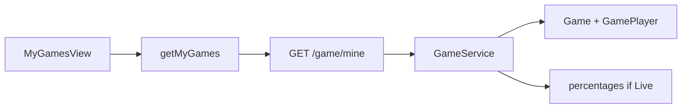

# Connect MyGamesView to Backend

## Current state

- [MyGamesView.tsx](Frontend/src/App/views/MyGamesView.tsx) renders hardcoded `myGamesData` (no API).
- [GameContext](Frontend/src/Context/GameContext.tsx) already loads `GET /game/current` into `currentGames`, but that query is **active + not eliminated only** — no history, no player fields, no percentages.
- Percentages live in Redis via `GameService.get_percentages` (used by `POST /game/choose` only).

## Target UX (locked)


| Case                                       | Badge / label                         | Heads/tails bar                    |
| ------------------------------------------ | ------------------------------------- | ---------------------------------- |
| Still playing                              | `Live`                                | Yes (from Redis for current round) |
| Cashed out / sole survivor paid            | `Won`                                 | No                                 |
| Wrong-side elimination                     | `Eliminated in round: {round_number}` | No                                 |
| Canceled (or otherwise closed without win) | `Ended`                               | No                                 |


Drop Unsplash images; keep the existing card layout (id, prize pool, status, optional bar, Details button stub).




---

## 1. Backend: outcome helper + `_cashout` fix

**Problem:** `_cashout` sets `is_eliminated=True` but does not set `cashout_decision`, so sole survivors look the same as wrong-side eliminations (`is_eliminated`, `cashout_decision=None`).

**Fix** in [Backend/Game/service.py](Backend/Game/service.py) `_cashout`: if `player.cashout_decision` is unset, set it to `"cashout"` before credit. Then outcome rules are:

- **live** — `not is_eliminated` and `game.status in {open, active, showdown_pending, showdown_active}`
- **won** — `cashout_decision == "cashout"`
- **eliminated** — `is_eliminated` and not won
- **ended** — `game.status == "canceled"`, or finished with no win/elimination edge case

---

## 2. Backend: schema + `GET /game/mine`

Add to [Backend/Game/schemas.py](Backend/Game/schemas.py):

```python
class MyGameItemResponse(BaseModel):
    id: int
    status: str
    start_date: datetime
    flip_time: datetime
    prize_pool: Decimal
    current_player_count: int
    initial_player_count: Optional[int]
    side: Optional[str]
    cashout_decision: Optional[str]
    round_number: int
    is_eliminated: bool
    outcome: str  # live | won | eliminated | ended
    heads: Optional[float] = None  # only when outcome == live
    tails: Optional[float] = None
```

Add `GameService.get_players_games(user_id, redis)`:

- Join `Game` ↔ `GamePlayer` where `user_id == user`
- Order by `Game.id` desc (newest first)
- For each row, compute `outcome`
- If live, call existing `get_percentages(game_id, player.round_number, redis)`; else leave `heads`/`tails` null

Add route in [Backend/Game/router.py](Backend/Game/router.py) **before** `/{game_id}/...` routes:

```python
@router.get("/mine", response_model=List[MyGameItemResponse])
async def get_my_games(... get_current_user, get_session, get_redis ...):
```

Keep `GET /game/current` unchanged (still used for `hasJoined` in GameContext).

---

## 3. Backend tests

Mirror existing Game router/service tests under [Backend/Tests/Game/](Backend/Tests/Game/):

- User with live seat → `outcome=live`, percentages present (mock Redis)
- Eliminated seat → `outcome=eliminated`, `round_number` set, no percentages
- Cashed-out / `_cashout` path → `outcome=won`
- Canceled game → `outcome=ended`
- Auth required (401 without cookie)
- Empty list for user with no seats

---

## 4. Frontend API

Extend [Frontend/src/Api/game.ts](Frontend/src/Api/game.ts):

```ts
export interface MyGameItem {
  id: number;
  status: string;
  start_date: string;
  flip_time: string;
  prize_pool: number;
  current_player_count: number;
  initial_player_count: number | null;
  side: string | null;
  cashout_decision: string | null;
  round_number: number;
  is_eliminated: boolean;
  outcome: 'live' | 'won' | 'eliminated' | 'ended';
  heads: number | null;
  tails: number | null;
}

export const getMyGames = () => client.get<MyGameItem[]>('/game/mine');
```

Do **not** load history in GameContext on every boot — only My Games needs it. Keep using `currentGames` for join status.

---

## 5. Wire [MyGamesView.tsx](Frontend/src/App/views/MyGamesView.tsx)

- `useEffect` → `getMyGames()` on mount; track `loading` / `error` / `games`
- Remove `myGamesData`
- Map API → UI:
  - Title id: `#${game.id}`
  - Prize: `Number(prize_pool).toLocaleString()`
  - Badge from `outcome`: Live / Won / Ended / `Eliminated in round: ${round_number}`
  - Heads/tails bar **only if** `outcome === 'live'` and `heads`/`tails` are numbers
  - Remove Unsplash `` (or replace with a small static decorative block — no remote mock photos)
- Empty state: short “No games yet” when list is empty
- “Game Details” stays non-navigating for this pass (no detail route yet)

Status styles: reuse existing Live/Ended/Won colors; map Eliminated to the current Lost (red) style.

---

## 6. Out of scope

- Game Details page / `GET /game/{id}/player` deep link
- `amount_won` persistence (still a model TODO)
- Changing sidebar routing to URL paths
- Polling/live Redis updates on the My Games list (refresh on visit is enough)

