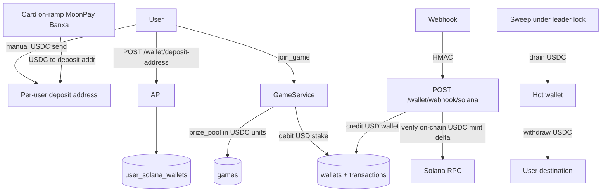

## Solana Wallet Hardening

### Product decisions (locked)

Aligned with [card_to_usdc_onramp_823a5ec7.plan.md](card_to_usdc_onramp_823a5ec7.plan.md) (Polymarket-shaped startup: one stablecoin, outsource fiat FX).

| Decision | Choice |
|---|---|
| Game currency | **USD only** — stake, `prize_pool`, payouts, leaderboard |
| USD backing | **USDC on Solana** (6 decimals). Mainnet mint `EPjFWdd5AufqSSqeM2qN1xzybapC8G4wEGGkZwyTDt1v`; devnet `4zMMC9srt5Ri5X14GAgXhaHii3GnPAEERYPJgZJDncDU` |
| Card / FX | **Outsourced** to MoonPay / Banxa (or later iGaming on-ramp). House does **not** convert fiat↔crypto or SOL↔USDC for users |
| Price fluctuation | Accept USDC≈USD; user-side FX/fees live at the on-ramp. **No** SOL or multi-fiat liabilities in the play ledger |
| Deposits | **USDC only** for play credit. Native SOL may sit on deposit addresses for rent/fees only — do **not** credit a SOL play balance |
| Join path | Debit **USD (USDC units)** wallet only |
| Convert product | **None** (Phase 1b cancelled — conflicts with lean custody and CGA “no convert for users”) |

Integer minor units stay (no floats). Unit is **USDC base units** (6 decimals → $1 = `1_000_000`), not lamports.

### Why not lamports for the game

A multi-day open game with `prize_pool` in lamports makes the dollar value of the pot drift with SOL/USD. Card-funded players would take unintended FX risk. Lamports are only for rent/fee SOL on deposit addresses — never the play ledger.

**Note on work already started:** models/services partly use `BigInteger` "lamports" and `GAME_STAKE_LAMPORTS = 1e9`. Migration `d5e6f7a8b9c0` treats old `1.00` credits as 1 SOL. That mapping is wrong for a USD/USDC game — Phase 1 must correct unit and stake before relying on that migration in any shared DB.

### Phase 0 - Stop the bleeding (do this first)

- Delete `/wallet/credit` and `/wallet/debit` in [Backend/Wallet/router.py](Backend/Wallet/router.py). Keep service methods for Game/Social. Optional local funding: admin/`DEBUG` only.
- Fail-closed `SOLANA_WEBHOOK_SECRET` / `SOLANA_HOT_WALLET_ADDRESS` — already present in [Backend/config.py](Backend/config.py); keep that invariant.
- Remove stale duplicate `Backend/Core/core_solana.py` if path-casing duplicates remain.

### Phase 1 - USD / USDC game economy (single play balance)

**Storage unit:** integer USDC minor units (**6** decimals → $1 = `1_000_000`). Prefer mint precision so deposits round-trip cleanly.

**Schema**

- `Wallet`: one play row per user with `currency = USD` (or `USDC` — pick one enum and stick to it). `balance` is `BigInteger` in USDC base units. **No** dual EUR+SOL play wallets for v1.
- `Transaction`: add `currency`; amounts are signed integers in USDC units.
- `games.prize_pool`, `leaderboard.total_earnings`: USDC minor units (not lamports). Comments and schema docs must say so.
- Replace / rescale migration `d5e6f7a8b9c0`:
  - If not applied anywhere: rewrite so old `1.00` → `1_000_000` USDC units, not `1e9` lamports.
  - If already applied: follow-up migration that rescales into the USD play wallet.
- Settings: `GAME_STAKE_USD_UNITS` (replaces `GAME_STAKE_LAMPORTS` / any EUR stake constant). Helpers in [Backend/Core/money.py](Backend/Core/money.py): USDC units ↔ display `$` string; lamports helpers only if needed for rent/fees.

**Game call sites** in [Backend/Game/service.py](Backend/Game/service.py): keep integer floor payout / rake (`* 98 // 100`); change stake/refund/prize increments to USDC units; `join_game` / `invite_friend` debit the **USD** wallet only.

**API:** balance responses return USD/USDC (raw int + display string). Frontend [Frontend/src/Api/wallet.ts](Frontend/src/Api/wallet.ts) must not treat the play balance as SOL.

### Phase 1b - CANCELLED (no quoted SOL → USD conversion)

Do **not** implement convert quote/execute, dual SOL play balance, or house batch SOL→USDC swaps for users. Fluctuation policy: USDC-only liabilities; fiat FX at on-ramp. See card on-ramp plan.

### Phase 2 - Per-user deposit addresses and key custody

- `cryptography` + `WALLET_ENCRYPTION_KEY`; `Backend/Core/crypto.py` encrypt/decrypt for `private_key_encrypted`.
- Unique + index on `user_solana_wallets.public_key`.
- `get_or_create_deposit_address`: generate keypair, store encrypted secret, ensure **USDC associated token account** exists (or create on first USDC credit / sweep).
- Endpoints: idempotent `POST /wallet/deposit-address`, `GET /wallet/deposit-address`.
- Scope: gambling payment rails (USDC in/out), not a general multi-asset wallet product.

### Phase 3 - Harden `Backend/Core/core_solana.py`

- Keypair from settings (never hardcoded path / never logged).
- `async with AsyncClient(...)`.
- `get_transaction(..., max_supported_transaction_version=0, commitment=Finalized)`.
- Verify helpers return **actual on-chain deltas**:
  - Native SOL: lamports delta only for ops/rent awareness (not play credit).
  - SPL: token amount delta for the **configured USDC mint** only.
- Typed `SolanaSendUnconfirmed` / `SolanaSendFailed`; pass `last_valid_block_height` into confirm.
- Hot-wallet balance / fee-payer preflight before send.

### Phase 4 - Deposit path

- Verify against **per-user** `public_key`, not the hot wallet address.
- Credit **on-chain USDC delta**, never the webhook's claimed amount.
- Mint-check USDC → credit USD play wallet. **Reject** unknown mints. Do **not** credit play balance for native SOL.
- HMAC: optional `sha256=` strip, non-ASCII → 401, non-empty secret.
- Webhook: duplicate `tx_hash` → **200** already-processed; unknown address → log + ack; not-yet-finalized → `pending_deposits` retry row, not a hard 400 drop.
- Card on-ramp integration details live in [card_to_usdc_onramp_823a5ec7.plan.md](card_to_usdc_onramp_823a5ec7.plan.md); this phase only ensures on-chain USDC credit is sound.

### Phase 5 - Withdrawal path

- `transactions.status` (`pending` / `confirmed` / `failed`) + `destination_address`.
- Debit + pending row in **one** DB transaction before RPC; then persist signature / flip status.
- Unconfirmed → do not refund; failed-before-send → `REFUND` (not `CREDIT`).
- `POST /wallet/withdraw`: USDC SPL transfer, Pubkey validation, fee deduction, daily cap, client idempotency key. Prefer same-asset out (USDC).

### Phase 6 - Sweep worker

- Leader-locked worker next to `GameEngine` / lifespan.
- Drain **USDC** from deposit addresses to hot wallet; leave rent-exempt SOL minimum on each deposit address.
- **Fee payer:** hot wallet must co-sign — card-funded addresses may hold USDC with insufficient SOL for fees.
- Reconcile `pending` withdrawals by re-checking signatures.

### Phase 7 - Transaction control

- Remove `commit` from `_apply_transaction` in [Backend/Wallet/services.py](Backend/Wallet/services.py); request/engine boundary owns commits so join cannot durable-debit then fail seat creation.

### Tests

- Game/wallet fixtures use USDC minor units and a single USD play wallet.
- Deposit tests: USDC mint credit; reject wrong mint; native SOL does not credit play balance.
- Solana helpers: returned deltas + typed exceptions; fix patch paths (`Backend.` prefix) in deposit tests if broken.
- No convert-quote tests (Phase 1b cancelled).
