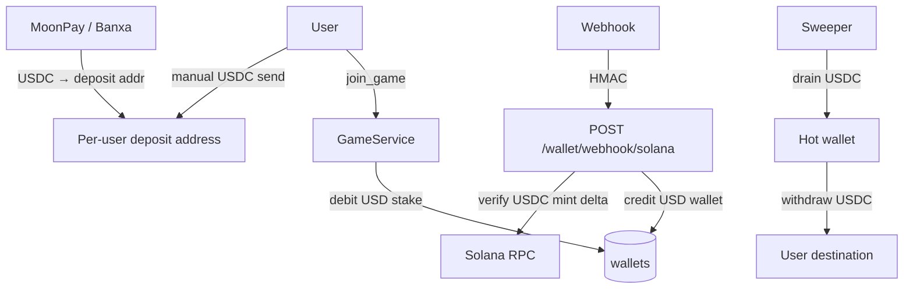

## Solana Wallet Hardening

Ledger + Solana custody for play money. Card checkout lives in [card_to_usdc_onramp_823a5ec7.plan.md](card_to_usdc_onramp_823a5ec7.plan.md).

### Locked decisions

| Topic | Choice |
|---|---|
| Game currency | USD only (stake, prize_pool, payouts, leaderboard) |
| Backing asset | USDC on Solana (6 decimals; $1 = `1_000_000`) |
| Card / FX | Outsourced to MoonPay / Banxa — house does not convert fiat or SOL |
| Deposits | USDC only credits play balance; native SOL on deposit addresses is rent/fees only |
| Convert | None |

### Phases

**0 — Stop the bleeding**
- Delete public `/wallet/credit` and `/wallet/debit` routes (keep service methods for Game/Social).
- Keep fail-closed `SOLANA_WEBHOOK_SECRET` / `SOLANA_HOT_WALLET_ADDRESS`.
- Remove stale `Backend/Core/core_solana.py` path-casing duplicate if present.

**1 — USD / USDC economy**
- One play `Wallet` per user; `balance` = USDC base units (`BigInteger`).
- `games.prize_pool`, leaderboard earnings, `Transaction` amounts → same units.
- Replace/rescale migration `d5e6f7a8b9c0` (old `1.00` → `1_000_000`, not lamports).
- `GAME_STAKE_USD_UNITS`; update [Backend/Game/service.py](Backend/Game/service.py) join/refund/payout paths.
- API + [Frontend/src/Api/wallet.ts](Frontend/src/Api/wallet.ts): treat balance as USD, not SOL.

**2 — Deposit addresses**
- Encrypt private keys (`WALLET_ENCRYPTION_KEY` + `Backend/Core/crypto.py`).
- Unique indexed `user_solana_wallets.public_key`.
- `get_or_create_deposit_address` (+ USDC ATA).
- Idempotent `POST` / `GET` `/wallet/deposit-address`.

**3 — Harden `core_solana.py`**
- Keypair from settings; `AsyncClient` context; v0 tx support.
- Return real on-chain deltas (SOL lamports for rent awareness; USDC SPL amount for credit).
- Typed send failures; hot-wallet fee-payer preflight.

**4 — Deposit**
- Verify against per-user address (not hot wallet).
- Credit on-chain USDC delta only; reject unknown mints; never credit play balance for native SOL.
- Webhook: duplicate `tx_hash` → 200; unknown address → log + ack; not finalized → retry row.

**5 — Withdraw**
- Debit + pending row in one DB txn, then send USDC SPL; persist signature / status.
- `POST /wallet/withdraw`: fee, daily cap, idempotency key, Pubkey validation.

**6 — Sweeper**
- Leader-locked worker: drain USDC to hot wallet; leave rent-exempt SOL; hot wallet fee-pays.
- Reconcile pending withdrawals by signature.

**7 — Transaction control**
- Drop `commit` from `_apply_transaction` so join cannot durable-debit then fail seat creation.

### Tests

- Fixtures use USDC minor units + single USD wallet.
- Deposit: USDC credit; reject wrong mint; SOL does not credit play.
- Solana helpers: deltas + typed exceptions; fix `Backend.` patch paths if broken.
