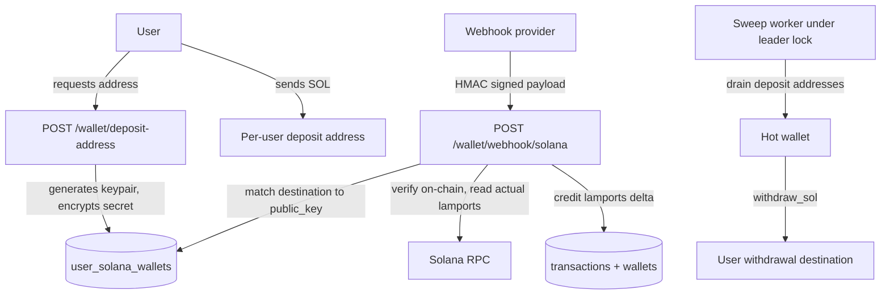

## Solana Wallet Hardening

Chosen architecture: **per-user deposit address swept to the hot wallet**, with all amounts stored as **integer lamports in `BigInteger`**.

### Phase 0 - Stop the bleeding (do this first, it is small)

- Delete the `/wallet/credit` and `/wallet/debit` routes in [Backend/Wallet/router.py](Backend/Wallet/router.py) lines 17-27. The service methods stay, since `Game/service.py` and `Social/service.py` depend on them; only the HTTP surface goes away. If you want a funding path for local testing, gate it behind an `is_admin`/`DEBUG` check rather than `get_current_user`.
- Make [Backend/config.py](Backend/config.py) fail closed: drthe `= ""` defaults onop  `SOLANA_WEBHOOK_SECRET` and `SOLANA_HOT_WALLET_ADDRESS` (or add a `model_validator` that raises when they are empty) so an unset secret cannot make every forged HMAC valid.
- Delete the stale duplicate `Backend/Core/core_solana.py` copy if `git status` shows one; the grep found the file twice under different path casings.

### Phase 1 - Lamports migration (touches the game economy)

New Alembic revision chaining from head `c4d5e6f7a8b9`:

- `wallets.balance`, `transactions.amount`, `games.prize_pool` -> `BigInteger`, converting existing rows with `USING (balance * 1000000000)::bigint`.
- Add `SOL_DECIMALS`/`LAMPORTS_PER_SOL` helpers and a `GAME_STAKE_LAMPORTS` setting (1.00 credit becomes an explicit lamport stake).

Call sites to convert in [Backend/Game/service.py](Backend/Game/service.py):

- Lines 31 and 44 - `wallet.debit(user_id, Decimal("1.00"))` becomes the stake constant.
- Line 191 - `payout = (game.prize_pool / len(players)).quantize(Decimal("0.01"))` must become integer floor division with the remainder explicitly retained (house or carried forward). Left as float/Decimal division it will mint or burn lamports.
- Line 418 `prize_pool += Decimal("1.00")`, line 373 refund, and lines 549-550 `prize_pool *= Decimal("0.98")` - the rake becomes `prize_pool * 98 // 100`.
- Lines 257 and 315 `Decimal(0)` become `0`.

Also update [Backend/Wallet/services.py](Backend/Wallet/services.py) lines 22 and 63 (`Decimal("0.00")` -> `0`), `BalanceResponse`/`TransactionResponse` in [Backend/Wallet/schemas.py](Backend/Wallet/schemas.py) to `int` lamports, and have the API return both `balance_lamports` and a display SOL string so [Frontend/src/Api/wallet.ts](Frontend/src/Api/wallet.ts) does not render raw lamports.

### Phase 2 - Per-user deposit addresses and key custody

- Add `cryptography` to [Backend/requirements.txt](Backend/requirements.txt) and a `WALLET_ENCRYPTION_KEY` setting.
- New `Backend/Core/crypto.py` with `encrypt_secret(bytes) -> bytes` / `decrypt_secret(bytes) -> bytes` (AES-GCM or Fernet). Nothing currently writes `private_key_encrypted`, so this is net-new.
- Migration: add `unique=True` plus an index on `user_solana_wallets.public_key`. Today it is unconstrained ([Backend/Wallet/models.py](Backend/Wallet/models.py) line 40), so a duplicate row makes `scalar_one_or_none()` in the webhook raise `MultipleResultsFound` and return a 500.
- `WalletService.get_or_create_deposit_address(user_id)` generates a `Keypair`, stores the encrypted secret, returns the public key. Expose as `POST /wallet/deposit-address` (idempotent) plus `GET /wallet/deposit-address`.

### Phase 3 - Harden `Backend/Core/core_solana.py`

- Replace the hardcoded `C:\\Users\\gunmo\\...\\solana_hot_wallet.json` read at line 22 with a keypair loaded once from settings (path or inline secret from the environment), and never log it.
- Wrap both clients in `async with AsyncClient(rpc_url) as client:` - lines 18 and 75 currently leak a session on every call.
- `get_transaction(sig, encoding="jsonParsed", max_supported_transaction_version=0, commitment=Finalized)`. Without the version argument, every v0 transaction returns an RPC error that is not a `ValueError` and so escapes the handler in `deposit_sol` lines 109-113 as a 500.
- Change `verify_solana_transaction` to **return the actual lamports received and the sender pubkey** instead of `True`, and to include `meta.loaded_addresses` when indexing `pre_balances`/`post_balances` (lines 89-99) so lookup-table accounts do not misalign the indices.
- Replace the `SENT_UNCONFIRMED:` string protocol (lines 56-61) with typed exceptions `SolanaSendUnconfirmed(signature)` and `SolanaSendFailed`, and pass `last_valid_block_height` from the blockhash response to `confirm_transaction` so an expired blockhash is reported as a definite failure (safe to refund) rather than "in flight".
- Add a hot-wallet `get_balance` preflight before building the transfer.

### Phase 4 - Deposit path

In [Backend/Wallet/services.py](Backend/Wallet/services.py):

- `deposit_sol` must verify against `solana_wallet.public_key`, not `settings.SOLANA_HOT_WALLET_ADDRESS` (line 105). This is the contradiction that makes every real deposit fail today.
- Credit the **on-chain lamports delta** returned by Phase 3, not the webhook's claimed amount (lines 94-97).
- HMAC block (lines 76-83): strip an optional `sha256=` prefix, wrap `compare_digest` in `try/except TypeError` so a non-ASCII header is a 401 rather than a 500, and assert the secret is non-empty.
- `SolanaWebhookPayload` in [Backend/Wallet/schemas.py](Backend/Wallet/schemas.py) lines 8-11: `amount_lamports: int = Field(gt=0)` with an upper bound, and a validator that `destination_address` parses as a `Pubkey`.
- Status codes: duplicate `tx_hash` (lines 123-127) returns **200** with an "already processed" body so the provider stops retrying; an unknown address (line 91) is logged and acked; a transient "not found on-chain" is recorded in a `pending_deposits` row for retry instead of being dropped on a 400.

### Phase 5 - Withdrawal path

- Migration: add `transactions.status` (`pending`/`confirmed`/`failed`) and `transactions.destination_address`.
- Rewrite `withdraw_sol` (lines 129-165) so the debit and a `status="pending"` withdrawal row carrying `destination_address` are written in **one** transaction before any network call, then the signature is persisted and the row flipped to `confirmed`. This closes the crash window where the committed debit at line 133 has no on-chain counterpart, and means the unconfirmed case no longer leaves the signature only inside a 502 response body (lines 148-153).
- Refund path (lines 155-159) uses `TransactionType.REFUND`, not `CREDIT`.
- New `POST /wallet/withdraw`: validate the destination as a `Pubkey` before debiting, enforce a minimum above the network fee, deduct the fee from the user's amount, apply a per-day cap, and accept a client idempotency key so a double click cannot produce two transfers.

### Phase 6 - Sweep worker

Add a sweeper alongside `GameEngine` in [Backend/Game/engine.py](Backend/Game/engine.py) / [Backend/lifespan.py](Backend/lifespan.py), started via the existing `run_if_leader(lock, engine)` so only one instance sweeps: drain confirmed balances from per-user deposit addresses into the hot wallet (leaving rent-exempt minimum), and reconcile `status="pending"` withdrawals by re-checking their signatures.

### Phase 7 - Transaction control

Remove `await self.session.commit()` from `_apply_transaction` (line 70) and let the request boundary in [Backend/db.py](Backend/db.py) `get_session` or the engine's explicit `session.commit()` own the boundary. This is what currently lets `Game/service.py` line 31 durably debit a user whose `_add_player_to_game` on line 32 then fails.

### Tests to update

`Backend/Tests/Wallet/**` and `Backend/Tests/Game/**` assert Decimal balances throughout (for example `wallet_service_tests.py` lines 18-62, `test_service_join_game.py` line 26, `conftest.py` fixtures) and will need lamport values. The Solana unit tests already mock `AsyncClient`, so Phase 3's signature changes mean updating `test_verify_solana_transaction.py` to assert the returned lamports and `test_solana_send_transaction.py` to assert the new typed exceptions instead of `SENT_UNCONFIRMED` strings. Note that `solana_service_deposit_tests.py` patches `Wallet.services.verify_solana_transaction` (missing the `Backend.` prefix used elsewhere) - worth confirming those tests actually run.