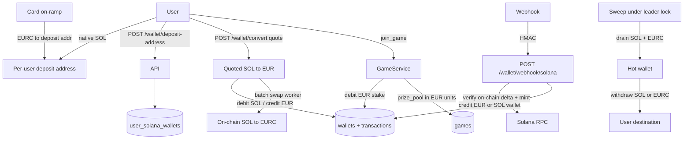

## Solana Wallet Hardening

### Product decisions (locked)

| Decision | Choice |
|---|---|
| Game currency | **EUR only** — stake, `prize_pool`, payouts, leaderboard |
| EUR backing | **EURC** (or equivalent EUR stablecoin) delivered on-chain by a card on-ramp |
| SOL price risk | **Swap at conversion** — house stays neutral; do not hold SOL against EUR liabilities |
| Join path | Debit **EUR balance** only; SOL→EUR is an explicit quoted step before join |

Integer minor units stay (no floats). Unit is **EUR stablecoin base units** (match mint decimals — typically 6 for EURC), not lamports. SOL deposits stay in a separate SOL balance until the user converts.

### Why not lamports for the game

A multi-day open game with `prize_pool` in lamports makes the euro value of the pot drift with SOL/EUR. Card-funded players would take unintended FX risk. Lamports remain correct **only** for the SOL wallet balance and native SOL transfers.

**Note on work already started:** models/services partly use `BigInteger` "lamports" and `GAME_STAKE_LAMPORTS = 1e9`. Migration `d5e6f7a8b9c0` treats old `1.00` credits as 1 SOL. That mapping is wrong for an EUR game — Phase 1 must correct unit and stake before relying on that migration in any shared DB.

### Phase 0 - Stop the bleeding (do this first)

- Delete `/wallet/credit` and `/wallet/debit` in [Backend/Wallet/router.py](Backend/Wallet/router.py). Keep service methods for Game/Social. Optional local funding: admin/`DEBUG` only.
- Fail-closed `SOLANA_WEBHOOK_SECRET` / `SOLANA_HOT_WALLET_ADDRESS` — already present in [Backend/config.py](Backend/config.py); keep that invariant.
- Remove stale duplicate `Backend/Core/core_solana.py` if path-casing duplicates remain.

### Phase 1 - EUR game economy + dual balances

**Storage unit:** integer EUR minor units matching EURC mint decimals (confirm mint; default assumption **6** → €1 = `1_000_000`). Prefer mint precision over cents so deposits round-trip without fractional-cent loss.

**Schema**

- `Wallet`: one row per `(user_id, currency)` with `currency` in `{EUR, SOL}`; unique constraint on that pair. `balance` is `BigInteger` in that currency's base units (EUR units or lamports).
- `Transaction`: add `currency`; amounts are signed integers in that currency's units.
- `games.prize_pool`, `leaderboard.total_earnings`: EUR minor units (not lamports). Comments and schema docs must say so.
- Replace / rescale migration `d5e6f7a8b9c0`:
  - If not applied anywhere: rewrite so old `1.00` → `1_000_000` EUR units (or mint-matched), not `1e9` lamports.
  - If already applied: follow-up migration that rescales and introduces dual wallet rows (migrate existing balance into EUR or SOL only after an explicit product rule for legacy rows).
- Settings: `GAME_STAKE_EUR_UNITS` (replaces `GAME_STAKE_LAMPORTS`). Helpers in [Backend/Core/money.py](Backend/Core/money.py): EUR ↔ display string, SOL ↔ lamports, keep both.

**Game call sites** in [Backend/Game/service.py](Backend/Game/service.py): keep integer floor payout / rake (`* 98 // 100`); change stake/refund/prize increments to EUR units; `join_game` / `invite_friend` debit the **EUR** wallet only.

**API:** balance responses return both currencies (raw ints + display strings). Frontend [Frontend/src/Api/wallet.ts](Frontend/src/Api/wallet.ts) must not treat the play balance as SOL.

### Phase 1b - Quoted SOL → EUR conversion

- `POST /wallet/convert/quote`: lock rate + spread, short TTL (~15–30s), return `quote_id`.
- `POST /wallet/convert`: accept `quote_id`; reject expired/mismatched amounts; write **SOL debit + EUR credit** sharing a `conversion_id` (and store rate used).
- Do **not** convert silently inside `join_game`.
- House neutrality: net conversions and batch the real SOL→EURC swap (threshold or timer). Exposure limited to that batch window.
- Provider caveat: if the on-ramp can only deliver USDC, either require EURC or swap USDC→EURC on credit so EUR liabilities stay euro-pegged.

### Phase 2 - Per-user deposit addresses and key custody

- `cryptography` + `WALLET_ENCRYPTION_KEY`; `Backend/Core/crypto.py` encrypt/decrypt for `private_key_encrypted`.
- Unique + index on `user_solana_wallets.public_key`.
- `get_or_create_deposit_address`: generate keypair, store encrypted secret, ensure **EURC associated token account** exists (or create on first EURC credit / sweep).
- Endpoints: idempotent `POST /wallet/deposit-address`, `GET /wallet/deposit-address`.

### Phase 3 - Harden `Backend/Core/core_solana.py`

- Keypair from settings (never hardcoded path / never logged).
- `async with AsyncClient(...)`.
- `get_transaction(..., max_supported_transaction_version=0, commitment=Finalized)`.
- Verify helpers return **actual on-chain deltas**:
  - Native SOL: lamports delta to deposit pubkey (include `meta.loaded_addresses` for index alignment).
  - SPL: token amount delta for the **configured EURC mint** only.
- Typed `SolanaSendUnconfirmed` / `SolanaSendFailed`; pass `last_valid_block_height` into confirm.
- Hot-wallet balance / fee-payer preflight before send.

### Phase 4 - Deposit path

- Verify against **per-user** `public_key`, not the hot wallet address.
- Credit **on-chain delta**, never the webhook's claimed amount.
- Route credit by asset: native SOL → SOL wallet; EURC (mint-checked) → EUR wallet. Reject unknown mints.
- HMAC: optional `sha256=` strip, non-ASCII → 401, non-empty secret.
- Webhook: duplicate `tx_hash` → **200** already-processed; unknown address → log + ack; not-yet-finalized → `pending_deposits` retry row, not a hard 400 drop.
- Card on-ramp: confirm restricted-business / gambling terms before locking a provider.

### Phase 5 - Withdrawal path

- `transactions.status` (`pending` / `confirmed` / `failed`) + `destination_address` (+ currency).
- Debit + pending row in **one** DB transaction before RPC; then persist signature / flip status.
- Unconfirmed → do not refund; failed-before-send → `REFUND` (not `CREDIT`).
- `POST /wallet/withdraw`: currency-aware (SOL transfer vs EURC SPL transfer), Pubkey validation, fee deduction, daily cap, client idempotency key.

### Phase 6 - Sweep worker

- Leader-locked worker next to `GameEngine` / lifespan.
- Drain SOL and EURC from deposit addresses to hot wallet; leave rent-exempt SOL minimum.
- **Fee payer:** hot wallet must co-sign — card-funded addresses may hold EURC with insufficient SOL for fees.
- Reconcile `pending` withdrawals by re-checking signatures.

### Phase 7 - Transaction control

- Remove `commit` from `_apply_transaction` in [Backend/Wallet/services.py](Backend/Wallet/services.py); request/engine boundary owns commits so join cannot durable-debit then fail seat creation.

### Tests

- Game/wallet fixtures use EUR minor units and dual wallets.
- Conversion quote expiry / spread / dual ledger rows.
- Deposit tests: SOL vs EURC mint paths; reject wrong mint.
- Solana helpers: returned deltas + typed exceptions; fix patch paths (`Backend.` prefix) in deposit tests if broken.
