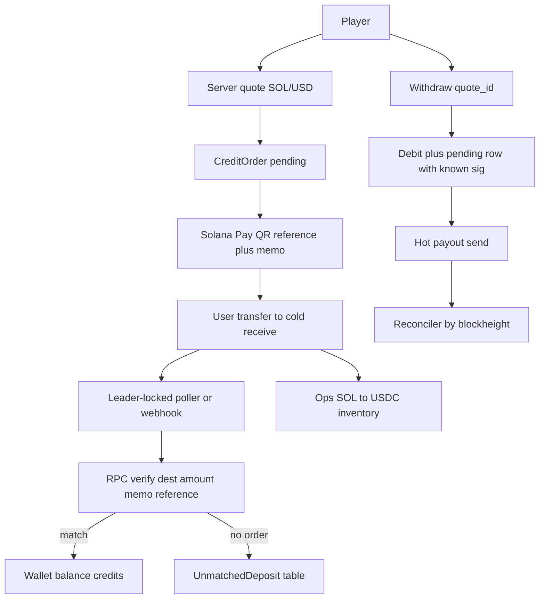

# Ticket credit rails (P2P, no card provider)

Supersedes [card_to_usdc_onramp_823a5ec7.plan.md](.cursor/plans/card_to_usdc_onramp_823a5ec7.plan.md) and replaces the product direction of [solana_wallet_hardening_1b526ddb.plan.md](.cursor/plans/solana_wallet_hardening_1b526ddb.plan.md) (keep useful security pieces: close public credit/debit, harden send/verify, transaction boundaries).

## Locked decisions

| Topic                 | Choice                                                                                                                                                          |
| --------------------- | --------------------------------------------------------------------------------------------------------------------------------------------------------------- |
| Product               | House sells **credits** (tickets); game already stakes `Decimal("1.00")` in [Backend/Game/service.py](Backend/Game/service.py)                                  |
| Peg                   | **1 credit = $1 USD** always                                                                                                                                    |
| Credit precision      | `Numeric(12, 2)` — buy may require whole credits; withdraw accepts 2 decimals (rake/showdown leave fractional balances)                                         |
| Chains v1             | **Solana only** for live pay-in/pay-out                                                                                                                         |
| Chains later          | Shared `PaymentRail` / `ChainAdapter` interface; Polygon adapter stubbed                                                                                        |
| Card / MoonPay        | **Out** — no fiat provider                                                                                                                                      |
| Deposit UX            | Shared **cold** house receive address + **Solana Pay** transfer request (`reference` pubkey + memo) — not memo-only (Phantom/Solflare send UIs often omit memo) |
| Confirm               | Automatic chain watcher (leader-locked RPC poll + optional webhook → verify on-chain → credit)                                                                  |
| Pay-in asset (Solana) | Native **SOL** quoted at live USD price + **swap-to-stable buffer only** (user already pays network fee on their transfer)                                      |
| Custody split         | **Cold receive** address (no server private key) vs **hot payout** wallet (capped float, secret-store keypair)                                                  |
| House FX              | After credit, ops converts SOL → USDC (manual first; fee buffer still charged); ledger never holds SOL as play money                                            |
| Fees                  | Buy: swap estimate + spread. Withdraw: network + ATA creation if needed + spread. Never trust client amounts                                                    |
| Withdraw v1           | User picks **SOL** or **USDC** (SPL) to a destination they own; house sends from hot inventory                                                                  |
| Withdraw later        | MATIC / Polygon USDC when Polygon adapter ships                                                                                                                 |
| Per-user deposit keys | **Not used**; delete / stop using [UserSolanaWallet](Backend/Wallet/models.py) for deposits                                                                     |

## Why shared cold address + Solana Pay (not per-user wallets)

- Receive address needs **no** private key on the server — deposits accumulate cold; hot wallet holds only a capped payout float.
- Attribution: Solana Pay `reference` (unique pubkey as readonly account key) + memo `order_ref`. Watcher finds txs via `getSignaturesForAddress(reference)` (and/or memo match).
- Match rules: destination = cold receive, amount ≥ quoted lamports (exact preferred), before expiry, commitment `finalized`.
- Missing/wrong memo or unmatched payment → `unmatched_deposits` (unique signature) for manual credit/refund — not an order `needs_review` status with nowhere to attach.
- Polygon later: same `CreditOrder` shape; attribution via unique amount fingerprint (cents).

## Money model

- `wallets.balance` = **credits** (`Numeric(12, 2)`). Display as credits / `$` equivalent, never as SOL.
- Game stake stays **1.00** credit per join.
- No “play USDC on-chain” liability; on-chain assets are **house inventory** only.
- Debit `credits` ≠ send `net_lamports` / USDC micro-units — FX and fees live only in the quote.

## Phase 0 — Cleanup (do first)

Already done: public `/wallet/credit` and `/wallet/debit` routes are gone ([Backend/Wallet/router.py](Backend/Wallet/router.py)).

Still required:

- **Delete** `deposit_sol`, `withdraw_sol`, and per-user lookup in `process_solana_webhook` ([Backend/Wallet/services.py](Backend/Wallet/services.py)) — they credit SOL-as-balance and 404 forever against a shared address (webhook retry storm).
- New webhook contract: payload carries **signature only**; amount, destination, memo/reference from RPC; credit amount from `CreditOrder.credits`. Unknown / unmatched → **200 + log** (never 404).
- Settings: `SOLANA_COLD_RECEIVE_ADDRESS`, `SOLANA_HOT_WALLET_ADDRESS`, hot keypair from secret store (fail-closed if missing); remove hard-coded path in [core_solana.py](Backend/Core/core_solana.py).
- `SOLANA_CLUSTER` + genesis/mint check at startup; **no** default mainnet `SOLANA_RPC_URL`.
- USDC mint from settings (mainnet vs devnet); never hard-code one mint while pointing RPC at the other.
- Drop unused `AmountRequest` if unused; supersede old plan overviews.

## Phase 1 — Transaction boundary (before orders / withdraw)

- Remove `await self.session.commit()` from `_apply_transaction` so callers own the unit of work ([services.py](Backend/Wallet/services.py) ~60–73).
- [Game/engine.py](Backend/Game/engine.py): wrap **each** game flip in `session.begin_nested()` so one failure does not commit half-flushed games with the final `session.commit()`.
- Prerequisite for atomic “mark paid + credit” and “debit + pending withdrawal row”.

## Phase 2 — Orders / quotes / rails model

- `CreditOrder`: `user_id`, `credits`, `chain`, `status`, unique `memo` / `order_ref`, unique `reference_pubkey` (Solana Pay), `quoted_atomic_amount`, `receive_address`, `expires_at`, unique nullable `paid_tx_hash`.
- `UnmatchedDeposit`: unique `tx_hash`, lamports, raw memo, status.
- **Server-side Quote** (DB or Redis): `id`, `user_id`, payload, `expires_at`. `/orders` and `/withdraw` accept `**quote_id` only** — never client-supplied `total_sol` / net amount.
- Validate `credits` with `Field(ge=1, le=MAX)` (buy); withdraw allows two-decimal amounts ≥ min.
- `Chain` enum + `ChainAdapter`: `quote_native`, `verify_deposit`, `send_native`, `send_usdc`. `SolanaAdapter` live; `PolygonAdapter` → 501.

## Phase 3 — Harden `core_solana` (verify + send contracts)

Verify must:

- Compare `account_keys[i].pubkey` (not `str(ParsedAccount)` — today’s compare always fails on real RPC).
- Pass `max_supported_transaction_version=0`; include `meta.loaded_addresses`.
- Parse Memo program instructions; match Solana Pay reference account.
- Require `finalized`; return **actual lamport delta** (not bare `True`).
- `async with AsyncClient(...)`; close clients.

Send must:

- Keypair from settings/secret store; typed errors.
- **Sign first** so signature is known **before** broadcast.
- Never treat “send failed” as safe-to-refund unless blockhash expired and signature absent on-chain.

Add at least one test from a **recorded real** `get_transaction` JSON (not only string-key mocks).

## Solana buy-credits flow

1. `POST /wallet/credits/quote` — `{ credits, chain: "solana" }` → server stores quote; returns `{ quote_id, usd, sol_amount, swap_fee_sol, total_sol, expires_at, price_source }` (~**5 min** TTL).
2. `POST /wallet/credits/orders` — body `{ quote_id }` only; creates `CreditOrder` from stored quote.
3. Cap open pending orders per user (e.g. 3). Rate-limit quotes. Oracle: Pyth preferred (or CoinGecko) with **staleness reject** (`publish_time` / `last_updated`); Redis-shared cache; bid/ask **spread** so quotes are not a free option.
4. UI: Solana Pay QR / deeplink (`solana:<cold>?amount=…&reference=…&memo=…`) + countdown. **SOL only** copy (no “SPL tokens”). Address/amount only from order response — delete hard-coded fake address in [DepositView.tsx](Frontend/src/App/views/DepositView.tsx).
5. Watcher / webhook → verify → `FOR UPDATE` order → mark `paid` + `credit(..., PURCHASE)` + set `paid_tx_hash` in **one DB txn**.
6. Idempotent: duplicate `tx_hash` / already-paid → ack, no double credit.
7. Rules: expired unpaid → `expired`. Underpay → `needs_review` or unmatched. Late pay after expiry → re-price at current oracle or review. Overpay beyond tolerance → review. Split payments → do not auto-credit.

Buy fee: **swap-to-stable estimate + spread only** (not network fee — payer already pays it).

## Watcher / webhook concurrency

- Run poller under existing [LeaderLock](Backend/Core/leader_lock.py) (same pattern as game engine).
- Persist last-processed signature / cursor; page `getSignaturesForAddress` (max 1000) so downtime does not miss deposits.
- Webhook + poller race: order row `FOR UPDATE` + unique `paid_tx_hash` / `transactions.tx_hash`.

## Withdraw flow (Solana) — do **not** copy today’s `withdraw_sol`

Today’s pattern refunds on any non-`SENT_UNCONFIRMED` error and can double-pay if `send_raw_transaction` fails after the node accepted the tx. Also debiting `amount_sol` credits and sending `amount_sol` SOL would overpay ~150× under a credit peg.

Correct pattern:

1. `POST /wallet/credits/withdraw/quote` — `{ credits, asset: "sol"|"usdc", destination }` → store quote; include network fee, ATA create rent if needed, spread; check **hot inventory** before offering USDC.
2. `POST /wallet/credits/withdraw` — `{ quote_id, idempotency_key }` (+ re-auth). Load quote; validate destination pubkey; enforce min (rent-exempt for SOL), daily cap, address allowlist + cooldown for new destinations.
3. Sign tx → known signature → **one DB txn**: debit credits + insert `pending` withdrawal with signature + `last_valid_block_height` → **commit** (do not hold `FOR UPDATE` through RPC confirm).
4. Broadcast; persist status. Any post-commit error leaves row `pending`.
5. **Reconciler**: refund only if blockhash expired **and** signature never found on-chain. Ambiguous / in-flight → manual review, never auto-refund.
6. Ship `funds_locked_until` / non-withdrawable winnings **before** withdraw goes live (void clawback race — see TODOs in [services.py](Backend/Wallet/services.py) / [Game/service.py](Backend/Game/service.py)).
7. USDC: mint from settings; ensure destination ATA exists or price create-ATA into quote; refuse debit if hot USDC inventory insufficient.

## Foundation for Polygon (no live rail yet)

- `Chain` enum: `solana` | `polygon`.
- Same `CreditOrder` / quote shape; `PolygonAdapter` raises / 501 until Phase P.

## Frontend

- Rewrite [DepositView.tsx](Frontend/src/App/views/DepositView.tsx): credits → Solana → quote → Solana Pay QR + status poll. Remove card fields and fake address.
- [WithdrawView.tsx](Frontend/src/App/views/WithdrawView.tsx): credits → SOL or USDC → destination + fee disclosure; remove bank mock for v1.
- [Frontend/src/Api/wallet.ts](Frontend/src/Api/wallet.ts): quote / order / withdraw / status; balance as credits.

## Security checklist (must land with the matching phase)

| Item                                                              | Phase |
| ----------------------------------------------------------------- | ----- |
| Delete SOL-as-balance deposit/withdraw + per-user webhook         | 0     |
| Cold receive vs hot payout; secret-store keypair                  | 0     |
| Cluster / mint / no mainnet default                               | 0     |
| Drop `_apply_transaction` commit; engine nested txns              | 1     |
| Quote bound by `quote_id`; amount bounds                          | 2     |
| Verify pubkey / v0 / LUT / memo / finalized / delta               | 3     |
| Sign-before-broadcast; typed send errors                          | 3     |
| Short TTL, order cap, oracle staleness, spread                    | 4     |
| Solana Pay + unmatched_deposits                                   | 4–5   |
| Leader-locked poller; cursor; race-safe credit                    | 5     |
| Pending row + reconciler; inventory; re-auth; allowlist; lockouts | 6     |

## Out of scope

- Card / MoonPay / Banxa.
- Live Polygon transfers (interface only).
- Per-user custodial deposit wallets.
- In-app player-facing “convert” beyond buy/withdraw quotes.
- Automatic Jupiter swap worker (ops manual at first; fee buffer still charged).
- Gambling / KYC licensing (ops/legal; not blocked in code plan but required before real-money launch).

## File touchpoints

- [Backend/Wallet/models.py](Backend/Wallet/models.py), [router.py](Backend/Wallet/router.py), [services.py](Backend/Wallet/services.py), [enums.py](Backend/Wallet/enums.py), [schemas.py](Backend/Wallet/schemas.py)
- New: `Backend/Wallet/orders.py` (or similar), `Backend/Wallet/rails/base.py`, `rails/solana.py`, stub `rails/polygon.py`, withdraw reconciler worker
- [Backend/Core/core_solana.py](Backend/Core/core_solana.py), [Backend/config.py](Backend/config.py), [Backend/Game/engine.py](Backend/Game/engine.py), [Backend/Core/leader_lock.py](Backend/Core/leader_lock.py)
- Frontend Deposit/Withdraw + `wallet.ts`
- Tests under `Backend/Tests/Wallet/` (include real RPC fixture, ambiguous send, late pay, webhook/poller race, v0 tx)
- Mark old plans superseded in their overviews when implementing docs hygiene

